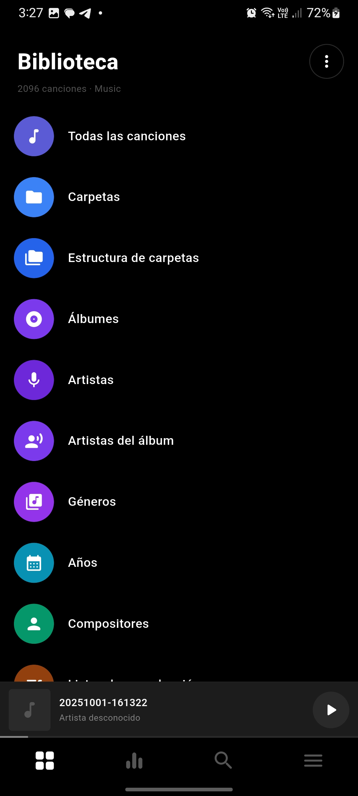

# PowerFlux

PowerFlux es un reproductor de música desarrollado con Flutter, diseñado para ofrecer una experiencia moderna, rápida y personalizable para la reproducción de música local.

## Características

* Reproducción de música local
* Biblioteca organizada por artistas, álbumes, géneros y listas de reproducción
* Búsqueda de canciones
* Gestión de favoritos y cola de reproducción
* Ecualizador
* Interfaz moderna inspirada en reproductores profesionales

## Versión

Versión actual: **v1.1**

## Tecnologías

* Flutter
* Dart
* Provider

## Estado

Proyecto en desarrollo activo.

## Registro de cambios

### v1.1

* Implementación de reproducción de música local
* Integración de ecualizador
* Refactorización con Provider
* Mejoras de interfaz y rendimiento

### v1.0

* Prototipo inicial de la aplicación
* Diseño de interfaz y navegación
* Estructura base del reproductor

## Capturas de pantalla

<table>
  <tr>
    <td align="center"><b>Icon</b></td>
    <td align="center"><b>Library</b></td>
    <td align="center"><b>Search</b></td>
    <td align="center"><b>Player</b></td>
  </tr>
  <tr>
    <td></td>
    <td></td>
    <td></td>
    <td></td>
  </tr>
</table>
